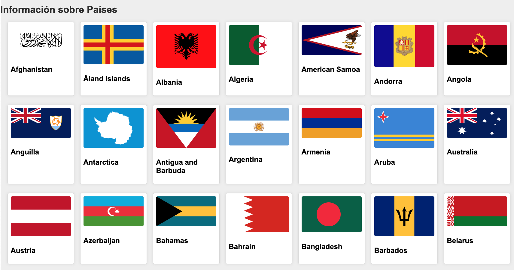
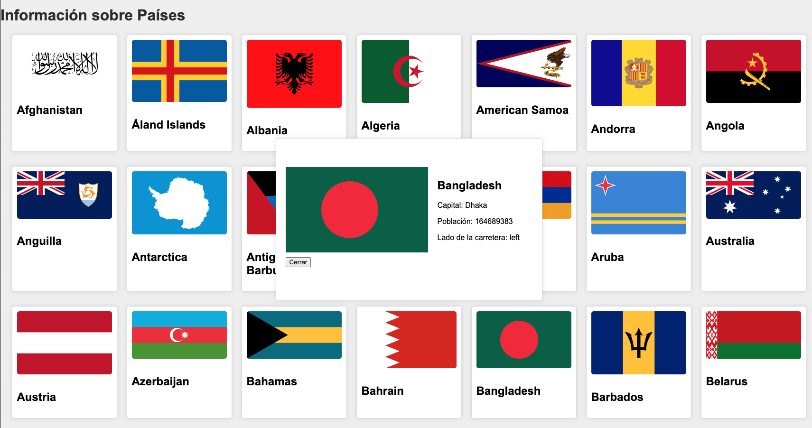

# Diversión con banderas

Este es un ejemplo de una aplicación que utiliza la API de REST Countries para obtener información sobre países y mostrarla en una interfaz de usuario. La aplicación está escrita en JavaScript y utiliza funciones asíncronas para manejar las llamadas a la API.

## Funcionalidades

- Al cargar el DOM, la aplicación tiene que llamar una función que realiza una solicitud a la API para obtener información sobre todos los países. Son 250, tarda un poco en renderizar.
- La información se ordena alfabéticamente.
- Al clickar en cada una de las banderas tendrá que mostrar la información detallada en una ventana flotante del país seleccionado. La Muestra información detallada sobre el país seleccionado, incluyendo la bandera, la capital, la población, el lado de la carretera por el que se circula.
- Tendrá un botón cerrar para hacer desaparecer esa información.

Tendrá este aspecto

## API utilizada

Esta aplicación utiliza la API de REST Countries para obtener información sobre los países. La URL de la API es [https://restcountries.com/v3/all](https://restcountries.com/v3/all).

## Notas y pistas

- Los paises se ordenarán en orden alfabético (recuerda el método `sort`). Recuerda que para ordenar no es lo mismo mayúsculas que minúsculas. Si comparas que sea lo mismo... pasa los nombres a mayúsculas si te parece más sencillo para la comparación.
- La información detallada incluye la bandera del país, la capital, la población y el lado de la carretera donde se circula. Este flotante se quedará fijo y centrado hasta que se cierre.
- La aplicación está diseñada con un enfoque simple y utiliza funciones asíncronas para manejar las solicitudes a la API. Recuerda que podrás usar fetch, Async/Await...
- Puedes manipular el `HTML` si lo necesitaras. 
- Si necesitas añadir clases a un elemento mediante JS, lo puedes hacer con `elemento.classList.add('clase que quieres añadir')` y para eliminar `elemento.classList.remove('clase que quieres añadir')`
